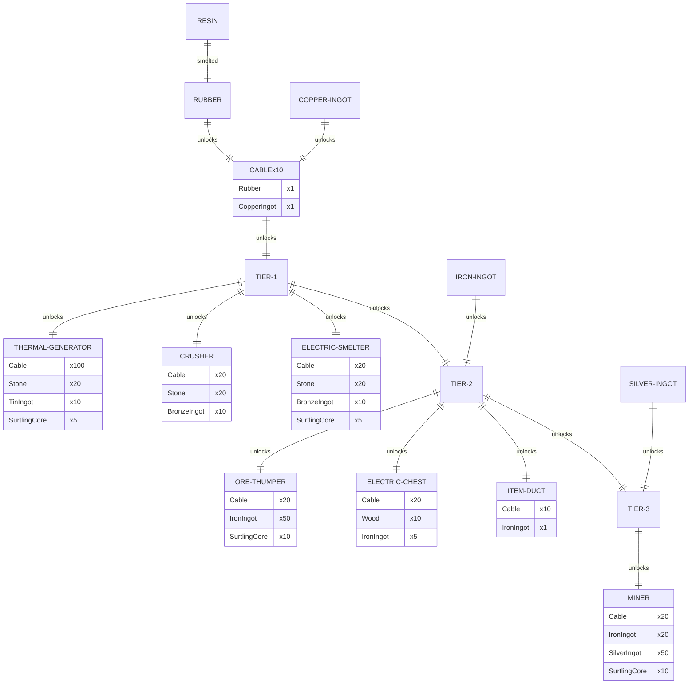

```mermaid
erDiagram
    RESIN ||--|| RUBBER : smelted
    CABLEx10 {
        Rubber x1
        CopperIngot x1
    }
    THERMAL-GENERATOR {
        Cable x100
        Stone x20
        TinIngot x10
        SurtlingCore x5
    }
    CRUSHER {
        Cable x20
        Stone x20
        BronzeIngot x10
    }
    ELECTRIC-SMELTER {
        Cable x20
        Stone x20
        BronzeIngot x10
        SurtlingCore x5
    }
    COPPER-INGOT ||--|| CABLEx10 : unlocks
    RUBBER ||--|| CABLEx10 : unlocks
    CABLEx10 ||--|| TIER-1 : unlocks
    TIER-1 ||--|| THERMAL-GENERATOR : unlocks
    TIER-1 ||--|| CRUSHER : unlocks
    TIER-1 ||--|| ELECTRIC-SMELTER : unlocks

    ORE-THUMPER {
        Cable x20
        IronIngot x50
        SurtlingCore x10
    }
    ELECTRIC-CHEST {
        Cable x20
        Wood x10
        IronIngot x5
    }
    ITEM-DUCT {
        Cable x10
        IronIngot x1
    }
    IRON-INGOT ||--|| TIER-2 : unlocks
    TIER-1 ||--|| TIER-2 : unlocks
    TIER-2 ||--|| ORE-THUMPER : unlocks
    TIER-2 ||--|| ELECTRIC-CHEST : unlocks
    TIER-2 ||--|| ITEM-DUCT : unlocks

    MINER {
        Cable x20
        IronIngot x20
        SilverIngot x50
        SurtlingCore x10
    }
    SILVER-INGOT ||--|| TIER-3 : unlocks
    TIER-2 ||--|| TIER-3 : unlocks
    TIER-3 ||--|| MINER : unlocks

```